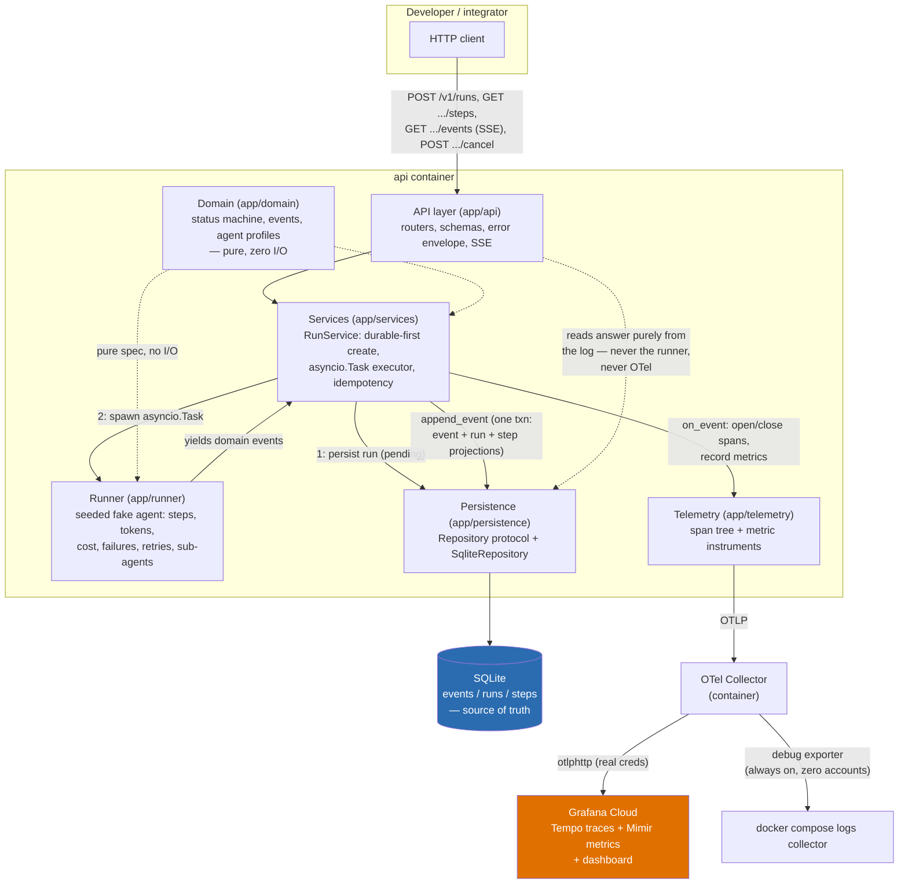
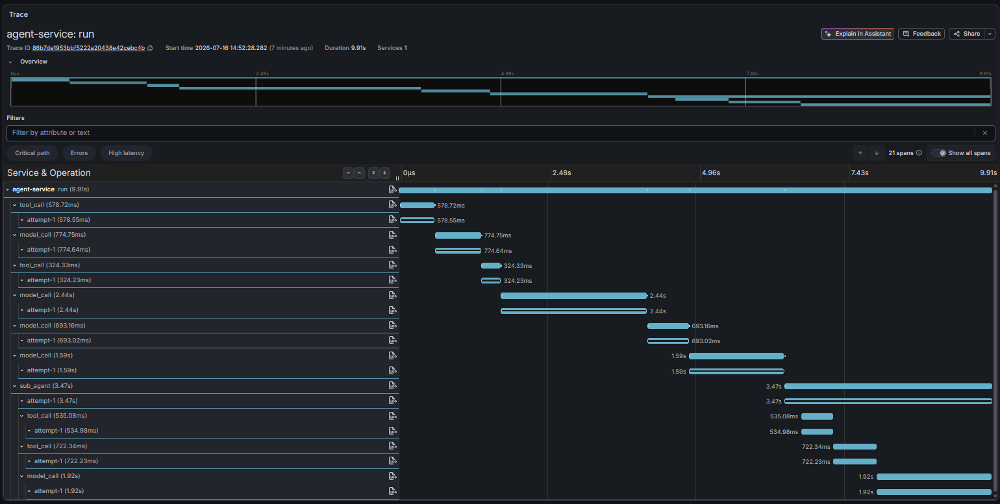
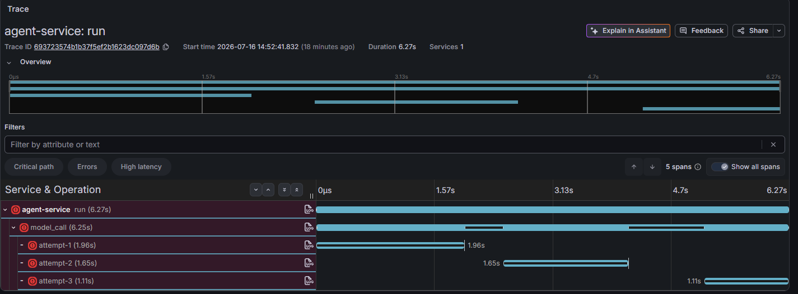
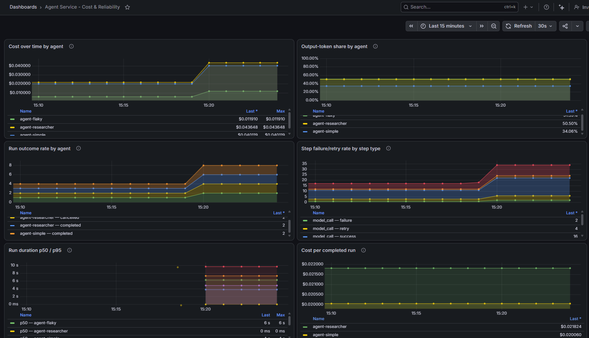

# Agent Runs API & Observability

A developer starts an **agent run** — a multi-step execution involving model
calls, tool calls, and occasionally sub-agents — through a public, versioned
HTTP API, follows it live to completion, and reads back what happened and
what it cost.

Behind the API sits a **seeded, deterministic fake runner**. Every step it
executes is instrumented once and emitted to two sinks: an append-only
**SQLite event log** (the source of truth, served back as three
projections — run envelope, steps, SSE stream) and **OpenTelemetry
spans/metrics**, exported through a local Collector to Grafana Cloud.

**Instrument once, serve three audiences** — the developer following a run
(API + SSE), the operator investigating one (traces), and the customer
acting on trends (the dashboard).

## What's built, what's cut

**Built — both required baselines, plus two features, plus three optional
extensions:**

- **API as a product** and **a trace you can investigate from** (the
  baselines)
- **Long-running runs done right** — the brief already demands an answer ("a
  run can outlast a request"), so we answered it properly: durable-first
  creation, poll + SSE with `Last-Event-ID` resume, restart recovery
- **Cost & token accounting** — it compounds the required analytics
  baseline: the customer-actionable view is cost-shaped, so one data model
  serves both
- Extensions: **idempotency keys**, **cancellation** (with its effect on the
  trace), **exemplars** (metric → trace click-through)

**Cut, deliberately:**

- **Webhooks** — the push counterpart of long-running runs; building both is
  redundant. Pull (poll + SSE) demos without the caller running
  infrastructure.
- **Rate limiting** and **audit trail** — both presuppose multi-tenancy, a
  named non-goal; they demo poorly single-user.
- **Batch API** — a loop over run creation unless real batch semantics are
  built; scope without new signal.

Full design rationale: [`docs/specs.md`](docs/specs.md).
Implementation plan with task-level detail: [`docs/todo.md`](docs/todo.md).

---

## Quickstart

No accounts required, in execution order:

```bash
make up      # serves the API on :8000, /docs for OpenAPI
```

OR, without `make` (e.g. plain Windows `cmd`):

```bash
docker compose up --build
```

With the stack up, seed it:

```bash
make demo    # seeds all three profiles, one guaranteed failure, one guaranteed cancellation
```

OR, without `make`:

```bash
python -m venv .venv
source .venv/bin/activate   # .venv\Scripts\activate on Windows
pip install -e ".[dev]"     # pulls in httpx, the only thing scripts/demo.py needs
python scripts/demo.py
```

This one also needs a one-time local Python setup first, since it runs on
your host rather than in Docker (see the
[walkthrough](#make-demo-walkthrough) below for why).

Other targets: `make test` (pytest, `SIM_SPEED=100` so the suite runs in
milliseconds), `make lint` (ruff), `make typecheck` (mypy), `make openapi`
(regenerate the committed `openapi.json` after a route/schema change),
`make down`.

## `make up` walkthrough

`make up` runs `docker compose up --build`, which serves the API on `:8000`
(`/docs` for OpenAPI) and starts an OTel Collector alongside it. The
Collector always emits traces/metrics to a `debug` exporter you can read
straight from `docker compose logs collector` — no external account needed
to see the telemetry working. Point it at Grafana Cloud by setting
`GRAFANA_CLOUD_OTLP_ENDPOINT` / `GRAFANA_CLOUD_OTLP_AUTH_HEADER` in `.env`
(see `.env.example`); everything else about the system is identical either
way.

## `make demo` walkthrough

[`scripts/demo.py`](scripts/demo.py) drives the live stack over real HTTP,
exactly as an external developer would — it's the only Milestone-8+ code
that isn't exercised by pytest. That's also why it runs on your host rather
than in Docker: it talks to the API the same way an external client would,
over the port `make up` already exposed, so it needs the one-time local
Python setup shown in [Quickstart](#quickstart) above rather than a container
of its own.

(Chose the host-setup route over rewriting `scripts/demo.py` onto
`urllib`/stdlib-only: the script's wait/poll/cancel logic is genuinely async
and `httpx` is already a declared dev dependency used by the test suite, so
a stdlib rewrite would just be a second implementation of the same HTTP
calls to maintain.)

It seeds:

| Run | Recipe | Outcome |
|---|---|---|
| `agent-researcher` | `seed=0` | completes cleanly (5–8 steps, some sub-agent nesting) |
| `agent-simple` | `seed=0` | completes cleanly (2–3 steps) |
| `agent-flaky` | `seed=1` | fails — a pinned non-retryable-failure seed, same one M3.T7's determinism test uses |
| `agent-researcher` | `seed=999` | cancelled ~0.25s after creation, mid-run |

All four seeds are hardcoded and known by construction, not luck: run
behavior is a pure function of `(agent_id, seed, input)` (the repo's core
invariant), so every seed above always produces the same outcome — verified
directly against the runner before being pinned into the script (see
`docs/todo.md` M8.T3.1).

After it finishes:

```bash
curl http://localhost:8000/v1/runs | jq   # no jq? drop the pipe — omit `| jq`
```

...and import [`grafana/dashboard.json`](grafana/dashboard.json) into
Grafana Cloud to see the six-panel analytics view populate.

## Architecture



| Component | Responsibility | Key decision |
|---|---|---|
| **API** (`app/api`) | Routers, schemas, error envelope, SSE | Envelope shared between create/read; overridden 422 handler so validation errors match the one `ErrorEnvelope` shape too |
| **Domain** (`app/domain`) | State machine, event types, agent profiles — pure, no I/O | Import-clean package is the checkable proof of layer separation |
| **Services** (`app/services`) | `RunService`: durable-first create, executor, idempotency | Executor spawns `asyncio.Task`; the queue-worker seam is a one-line comment at that call site |
| **Persistence** (`app/persistence`) | `Repository` protocol + `SqliteRepository`, append-only log, eager projections | Event append + step row + run totals in one transaction; Postgres seam is one adapter away |
| **Runner** (`app/runner`) | The fake agent: steps, latency, tokens, cost, failures, retries, sub-agents | All randomness from the recipe-seeded RNG; `SIM_SPEED` scales sleeps only, never recorded durations |
| **Telemetry** (`app/telemetry`) | OTel setup, span helpers, metric instruments | Spans are telemetry, the log is truth — nothing reads back from OTel |
| **OTel Collector** | Receives OTLP, forwards to Grafana Cloud | `debug` exporter always on, so the system runs fully without any account |
| **Grafana Cloud** | Tempo traces, Mimir metrics, the dashboard | OTLP endpoint is pure config — any backend can be swapped in |

## Decisions (the alternative each one beat)

- **Durable-first execution** — `POST /v1/runs` persists `pending` *before*
  spawning the run, so the `202` never lies. Beats "execute then persist,"
  which can claim a run exists when a crash before the write would leave it
  invisible.
- **`cancelling` is a persisted status, not an in-memory flag** — a crashed
  and restarted process can still observe and finish a cancellation from the
  store alone. Beats an in-memory-only signal, which loses the cancel
  request across a restart.
- **SQLite via `aiosqlite`, repository pattern** — zero-setup, single-writer
  is fine for one process; the `Repository` protocol is the documented seam
  to swap in Postgres later without touching call sites.
- **ULIDs as run IDs** — time-sortable, so the ID doubles as the pagination
  cursor. Beats UUID4 + offset pagination, which is both less informative
  and shifts pages under concurrent writes (explicitly rejected, PRD §3.3).
- **`asyncio.Task` in-process executor** — beats standing up a real queue
  for this scope; the enqueue seam is a documented one-line swap.
- **SSE with `Last-Event-ID` resume** — beats WebSockets for a one-way
  follow: no bidirectional complexity, and correctness falls straight out of
  "the stream is just a tail of the persisted log."
- **Idempotency via a `UNIQUE` DB constraint** — the concurrent-race case
  (two requests, same new key) is decided by the database, not app-level
  locking; the loser catches the constraint violation and replays instead of
  erroring.
- **Cardinality-disciplined metrics** — no `run_id` or `metadata.*` labels,
  ever (enforced by each `record_*` method's signature, not convention).
  Beats the naive version, which would blow up cardinality the moment this
  ran against real traffic.
- **OTel Collector with a `debug`-exporter fallback** — the app never holds
  vendor credentials (production shape), and the system runs fully with zero
  accounts if Grafana Cloud creds are unset.
- **Grafana Cloud** over Honeycomb (weaker metrics story) and SigNoz (a
  heavier compose stack than "two commands, no accounts" wants).
- **Cost/count dashboard panels read raw cumulative counters, not
  `rate()`/`increase()`** — `make demo` produces a one-off burst, not
  continuous traffic; windowed rate functions extrapolate over so few
  samples that a true value of `1` can render as `0` (see `docs/todo.md`
  M9.T6.3). The duration histogram panel is the one exception —
  `histogram_quantile` genuinely needs `increase()` to compute a quantile
  from bucket counts.

**The two I'm least sure about:** (1) the in-process `asyncio.Task`
executor — right for this scope, but if runs stretched to hours, restart
recovery marking them `failed` becomes a real product cost; the queue-worker
seam exists precisely because this line moves. (2) The dashboard's
raw-counter queries — correct for `make demo`'s burst-shaped data, but a
production deployment with continuous traffic would want the `rate()`-based
forms these replaced; the panels are tuned to demo honestly, which is
itself a trade.

## Curl tour

```bash
# 1. Start a run — 202 + Location header + the pending envelope, trace_id already set
curl -i -X POST http://localhost:8000/v1/runs \
  -H "Content-Type: application/json" \
  -d '{"agent_id": "agent-researcher", "input": {"prompt": "summarize the attached document"}, "seed": 42}'
# -> 202 Accepted, Location: /v1/runs/01J...
# {"id": "01J...", "status": "pending", "trace_id": "9a15...", ...}

RUN_ID=01J...   # from the response above

# 2. Poll for status/totals
curl http://localhost:8000/v1/runs/$RUN_ID

# 2b. Per-step detail
curl http://localhost:8000/v1/runs/$RUN_ID/steps

# 3. Follow live via SSE — Ctrl-C mid-stream, then resume with Last-Event-ID
curl -N http://localhost:8000/v1/runs/$RUN_ID/events
curl -N -H "Last-Event-ID: 3" http://localhost:8000/v1/runs/$RUN_ID/events   # resumes from sequence 4

# 4. Cancel a run (409 if it's already terminal)
curl -i -X POST http://localhost:8000/v1/runs/$RUN_ID/cancel

# 5. Retry-safe create — same key + same body replays the same run, no double execution
curl -i -X POST http://localhost:8000/v1/runs \
  -H "Content-Type: application/json" \
  -H "Idempotency-Key: demo-key-1" \
  -d '{"agent_id": "agent-simple", "input": {"prompt": "x"}}'
curl -i -X POST http://localhost:8000/v1/runs \
  -H "Content-Type: application/json" \
  -H "Idempotency-Key: demo-key-1" \
  -d '{"agent_id": "agent-simple", "input": {"prompt": "x"}}'
# -> identical response both times, same "id"
```

Full OpenAPI spec: [`/docs`](http://localhost:8000/docs) while the stack is
running, or the committed [`openapi.json`](openapi.json).

## Screenshots

_(Added after a live `make demo` + Grafana Cloud run — see
[`docs/images/README.md`](docs/images/README.md) for what each should show.)_

**Trace waterfall — `agent-researcher`:** root span, per-step children,
sub-agent nesting.



**Trace waterfall — `agent-flaky` retry:** each retry attempt as its own
child span, backoff visible as a gap.



**Dashboard:** the six analytics panels with `make demo` data loaded.



## Defense questions

See [`docs/defense-questions.md`](docs/defense-questions.md) for the five
questions named in PRD §7 Phase 8 (event log & projections, SSE resume,
durable-first lifecycle, spans vs. events, metric cardinality), each
answered with a pointer to the specific code/decision.

## AI usage

The build ran as a two-loop process: design decisions were made one at a
time in a separate AI-assisted planning conversation and locked into
`docs/specs.md`; Claude Code then implemented milestone-by-milestone against
that spec, stopping at a gate after each one where I independently ran the
tests and exercised the system by hand. Most of what follows was caught at
those gates, not by reading diffs.

**Where it helped:** essentially all code volume — scaffolding, the
event-sourced persistence layer, 195 tests, telemetry wiring. Beyond volume,
it filled gaps the spec implied but never stated (an in-process pub/sub so
the SSE tail doesn't poll the DB; an import-linter test making layer
separation checkable, not aspirational), flagged its own design gaps early
(a missing `RunCancelling` event type, two milestones before it would have
bitten), and pushed back on me when I cited spec text from memory that the
actual file didn't contain — refusing to change code until the spec was
reconciled.

**Where it was wrong, and how it got caught:**

- **README assumptions (caught by acting as the reviewer).** I downloaded my
  own repo onto a fresh workspace and strictly followed the README to
  emulate how an external person would go through the project. The
  simplified `make` commands didn't work on Windows, so I wrote alternate
  commands; and there were assumptions about dependencies that made the demo
  work on my machine but not on a fresh one — it only ran because of a
  globally installed package a reviewer wouldn't have. I realised the setup
  steps had to be in the README before anyone else could run it.
- **`input` typed as `str` (caught at the milestone gate with the spec's own
  example).** The create endpoint's schema typed `input` as a string; the
  spec defines it as a JSON object. All 132 tests at that point passed —
  written by the same author as the code, they shared the same wrong
  assumption. The gate's curl tour, using the spec's own example payload,
  got a 422 on the first request. The fix rippled through six packages,
  including re-finding pinned determinism seeds, since input encoding feeds
  the RNG.
- **Idempotency crash-window 500 (caught by adversarial gate review).**
  Reserve-then-create left a window where a crash stranded the key pointing
  at a run id that was never created — a client explicitly told retrying was
  safe would crash the lookup with a raw assertion 500. One review question
  exposed it; the fix collapsed reserve+create into a single transaction,
  making the bad state structurally unreachable, plus a test that
  hand-crafts the corruption and proves the reclaim.
- **Exemplars silently dropped, then unlinkable (caught only by verifying
  against the real backend).** The telemetry milestone looked complete — in
  unit tests. Against the live collector, no exemplar ever attached (spans
  were never "current" for OTel's filter); once fixed, the trace label our
  pipeline emits (`trace_id`, hardcoded by the OTel spec) couldn't match
  Grafana Cloud's read-only provisioned datasource (`traceID`). Solved with
  a redundant exemplar-only attribute kept off the metric's label set,
  preserving cardinality discipline.

**The meta-catch:** even the planning artifacts drifted — the AI-drafted PRD
silently dropped two requirements from this brief (this section, and the
demo-video format), caught by diffing the final deliverable against the
original brief before submission.
